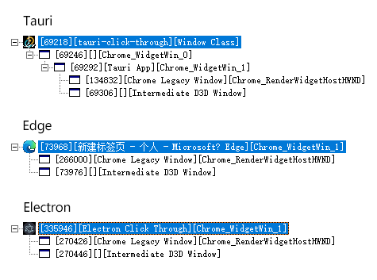
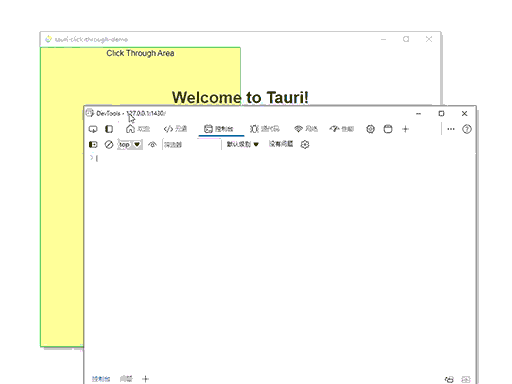
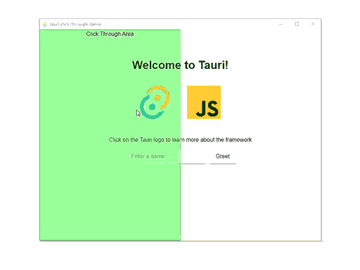

## 前言
对于需要窗口透明的应用，通常要求透明的区域点击穿透，非透明的区域则可以使用鼠标进行交互。

**Tauri** 和 **Electron** 则为开发着提供了**忽略鼠标事件**的方法。当鼠标消息无法发送给目标进程，那么就会得到点击穿透的效果。

但无法选择忽略的鼠标消息类型，因此开发者无法再通过鼠标事件去启停**忽略鼠标消息**。意味着只能启用，不能停用。无法实现更复杂的交互。

而 **Electron** 在此基础上增加了**鼠标消息转发**。拦截全局鼠标消息，然后将鼠标的移动位置转发给目标进程。开发者则可以通过鼠标移动产生的事件（`mousemove/mouseenter/mouseleave`），启停**忽略鼠标消息**。

本文将借鉴 **Electron** 中 **Windows** 系统的实现，并将其移植到 **Tauri** 中。

## 代码
完整的代码示例：[aweikalee/tauri-click-through-demo](https://github.com/aweikalee/tauri-click-through-demo)。

主要参考的 **Electron** 代码：[electron/native_window_views_win.cc](https://github.com/electron/electron/blob/main/shell/browser/native_window_views_win.cc) 中的 `SetForwardMouseMessages` 方法。

## 移植
### 前期准备
先安装依赖：
```
cargo add windows -F Win32_Foundation -F Win32_UI_WindowsAndMessaging -F Win32_Graphics_Gdi
cargo add once_cell
```

**Windows** 中， 使用 `Win32 API` 管理进程，需要引入依赖 `windows.rs` 或 `winapi`。前者微软官方维护，后者社区维护。**Tauri** 使用 `windows.rs`，故本文也将使用 `windows.rs`。

`once_cell` 等用到了再说。

接着我们需要创建一个函数代替 **Tauri** 原先的 `setIgnoreCursorEvents`。并暴露给前端。
```rust
// 将会用到的依赖，后文将不再提及
use once_cell::sync::Lazy;
use std::collections::HashSet;
use windows::Win32::{
  Foundation::{HWND, LPARAM, LRESULT, RECT, WPARAM},
  Graphics::Gdi::{PtInRect, ScreenToClient},
  UI::WindowsAndMessaging::*,
};

#[tauri::command]
fn set_ignore_cursor_events(window: tauri::Window, ignore: bool, forward: bool) {
  let hwnd = {
    let hwnd = window.hwnd().unwrap(); // 此处的 HWND 是 Tauri 定义的
    HWND(hwnd.0) // 需要转换为 Win32 定义的 HWND
  };

  let forward = if ignore { forward } else { false };
  unsafe { set_forward_mouse_messages(hwnd, forward) }; // 后续实现
}

fn main() {
  tauri::Builder::default()
    .invoke_handler(tauri::generate_handler![set_ignore_cursor_events]) // 暴露给前端
    .run(tauri::generate_context!())
    .expect("error while running tauri application");
}
```

### 忽略鼠标消息
**Tauri** 已经实现了这一步，可以直接调用 `set_ignore_cursor_events`：
```rust
#[tauri::command]
fn set_ignore_cursor_events(window: tauri::Window, ignore: bool, forward: bool) {
  window.set_ignore_cursor_events(ignore).unwrap();
}
```

`set_ignore_cursor_events` 的实现大致如下，不想了解的可以跳到下一节。

> 下面的代码是 **Electron** 的移植版。

```rust
fn set_ignore_cursor_events(window: tauri::Window, label: &str, ignore: bool, forward: bool) {
  let hwnd = {
    let hwnd = window.hwnd().unwrap();
    HWND(hwnd.0)
  };

  unsafe {
    // 获取窗口原有的样式
    let mut ex_style = WINDOW_EX_STYLE(GetWindowLongW(hwnd, GWL_EXSTYLE) as u32); // 获取 hwnd 句柄的进程上的 GWL_EXSTYLE 属性

    if ignore {
      // 添加样式
      ex_style |= WS_EX_TRANSPARENT | WS_EX_LAYERED;
    } else {
      // 移除样式
      ex_style &= !(WS_EX_TRANSPARENT | WS_EX_LAYERED);
    }

    // 将样式应用到窗口上
    SetWindowLongW(hwnd, GWL_EXSTYLE, ex_style.0 as i32);
  }
}
```

添加和移除样式是通过**位运算**进行的，`WS_EX_TRANSPARENT` 与 `WS_EX_LAYERED` 的值分别是 `32`、`524288`。将其转换位二进制应该就很好理解了：`32=100000`、`524288=10000000000000000000`。若还不理解请补一补**位运算**。

通常 `WS_EX_TRANSPARENT` 或 `WS_EX_LAYERED` 都是整数常量，但在 `windows.rs` 中它们是元组：`WS_EX_TRANSPARENT=WINDOW_EX_STYLE(32)`。使用时需要频繁转换类型。当然也可以选择取出整数进行使用，比如：`WS_EX_TRANSPARENT.0` 。

`WS_EX_TRANSPARENT` 样式会使**鼠标事件透明**（即忽略所有鼠标事件），`WS_EX_LAYERED` 样式会使窗口视觉上透明。

### 设置鼠标消息钩子
当前进程无法接受任何鼠标消息，需要通过全局鼠标钩子获取鼠标位置，然后将鼠标位置转发给目标进程。

#### 声明全局变量
```rust
static mut MOUSE_HOOK_: Option<HHOOK> = None;
static mut FORWARDING_WINDOWS_: Lazy<HashSet<isize>> = Lazy::new(|| HashSet::new());
```

需要用到两个全局变量：
- `MOUSE_HOOK_` 储存全局鼠标钩子的句柄，用于卸载钩子。
- `FORWARDING_WINDOWS_` 储存需要转发鼠标消息的进程句柄。

`FORWARDING_WINDOWS_` 是 `HashSet`，因大小不确定，不能直接创建为全局变量。故引入 `once_cell`，通过 `once_cell::Lazy` 进行创建。

#### 管理进程句柄
```rust
unsafe fn set_forward_mouse_messages(hwnd: HWND, forward: bool) {
  if forward {
    FORWARDING_WINDOWS_.insert(hwnd.0); // 插入
  } else {
    FORWARDING_WINDOWS_.remove(&hwnd.0); // 移除
  }
}
```

`set_forward_mouse_messages` 中存在大量不安全操作，所以函数前直接添加了 `unsafe` 的声明。

**Electron** 中 `FORWARDING_WINDOWS_` 储存的是 `NativeWindowViews` 的实例。此处实现取而代之的是直接储存进程句柄。

由于 `HWND` 并未实现 `Hash` 方法，无法确定唯一性，故直接从元组里取出原始值进行操作。

##### 修正句柄


由于 **Tauri** 进程内部比 **Electron** 多了两层进程，将消息发送给最外层的主进程，浏览器进程不会收到消息。

于是用了点脏方法，在主进程上获取第一次子进程句柄，再获取子进程句柄的第一个子进程句柄。

```rust
unsafe fn set_forward_mouse_messages(hwnd: HWND, forward: bool) {
  let browser_hwnd = {
    let hwnd = GetWindow(hwnd, GW_CHILD);
    GetWindow(hwnd, GW_CHILD)
  };

  if forward {
    FORWARDING_WINDOWS_.insert(browser_hwnd.0);
  } else {
    FORWARDING_WINDOWS_.remove(&browser_hwnd.0);
  }
}
```

`GetWindow(hwnd, GW_CHILD)` 获取的是第一个子进程的句柄。

#### 设置与卸载钩子
```rust
unsafe fn set_forward_mouse_messages(hwnd: HWND, forward: bool) {
  if forward {
    FORWARDING_WINDOWS_.insert(hwnd.0);

    match MOUSE_HOOK_ {
      Some(_) => {}
      None => {
        MOUSE_HOOK_ =
          Some(SetWindowsHookExW(WH_MOUSE_LL, Some(mousemove_forward), None, 0).unwrap());
      }
    }
  } else {
    FORWARDING_WINDOWS_.remove(&hwnd.0);

    if FORWARDING_WINDOWS_.len() == 0 {
      match MOUSE_HOOK_ {
        Some(hook) => {
          UnhookWindowsHookEx(hook).unwrap();
          MOUSE_HOOK_ = None;
        }
        None => {}
      }
    }
  }
}
```

全局钩子只需设置一次，卸载时则需要等所有进程都被卸载后再卸载全局钩子。

`WH_MOUSE_LL` 表示低级鼠标钩子，或者说是全局鼠标钩子。`mousemove_forward` 为处理函数。因挂载的是全局钩子，故 `SetWindowsHookExW` 后两个参数用不到。

##### `SetWindowsHookExA` 与 `SetWindowsHookExW`
`SetWindowsHookEx` 存在两个版本的函数：`SetWindowsHookExA` 与 `SetWindowsHookExW`。`A` 代表 _ANSI_，`W` 代表 _UNICODE_。通常会有以下这段宏，根据编译环境，将 `SetWindowsHookEx` 定义为 `SetWindowsHookExA` 或 `SetWindowsHookExW`：

```cpp
#ifdef UNICODE
#define SetWindowsHookEx  SetWindowsHookExW
#else
#define SetWindowsHookEx  SetWindowsHookExA
#endif // !UNICODE
```

由于 **Tauri** 中使用的都为 _UNICODE_ 版本，故直接使用 `SetWindowsHookExW`。`Win32` 中很多函数都存在这样的两个版本，之后将都会使用 _UNICODE_ 版本。上文出现过的 `GetWindowLongW` 和 `SetWindowLongW` 同理。


### 处理鼠标消息
接着实现 `mousemove_forward` 函数。将捕获到的 `WM_MOUSEMOVE` 事件，转换坐标后转发给目标进程。

```rust
unsafe extern "system" fn mousemove_forward(
  n_code: i32,
  w_param: WPARAM,
  l_param: LPARAM,
) -> LRESULT {
  if n_code < 0 {
    return CallNextHookEx(None, n_code, w_param, l_param);
  }

  if w_param.0 as u32 == WM_MOUSEMOVE {
    let p = l_param.0 as *const MSLLHOOKSTRUCT;
    let p = (*p).pt;

    for &hwnd in FORWARDING_WINDOWS_.iter() {
      let hwnd = HWND(hwnd);

      let mut client_rect = RECT {
        left: 0,
        top: 0,
        right: 0,
        bottom: 0,
      };
      GetClientRect(hwnd, &mut client_rect).unwrap();

      let mut p = p.clone();
      ScreenToClient(hwnd, &mut p).unwrap();

      if PtInRect(&client_rect, p).as_bool() {
        let w = WPARAM(0);
        let l = LPARAM(MAKELPARAM!(p.x, p.y));
        PostMessageW(hwnd, WM_MOUSEMOVE, w, l).unwrap();
      }
    }
  }

  CallNextHookEx(None, n_code, w_param, l_param)
}
```

- `n_code` 为确定如何处理消息的代码。微软文档中说：_如果 nCode 小于零，则挂钩过程必须将消息传递给 CallNextHookEx 函数，而无需进一步处理，并且应返回 CallNextHookEx 返回的值_。不过我实际获取到的 `n_code` 的值只有 `0`。
- `w_param` 为鼠标消息标识，用于区分消息类型。我们只对 `WM_MOUSEMOVE` 消息进行处理。
- `l_param` 是指向 `MSLLHOOKSTRUCT` 结构体的指针的值。`MSLLHOOKSTRUCT` 上有我们需要的鼠标坐标信息。

#### 获取坐标信息
`l_param` 是个整数，内存指针的值，需要通过强转类型转为原始指针使用：
```rust
let p = l_param.0 as *const MSLLHOOKSTRUCT; // 强转为 MSLLHOOKSTRUCT 的原始指针
let p = (*p).pt; // 解引用原始指针，再获取 MSLLHOOKSTRUCT 的 pt 字段
```

#### 获取窗口坐标信息
```rust
let mut client_rect = RECT {
  left: 0,
  top: 0,
  right: 0,
  bottom: 0,
};
GetClientRect(hwnd, &mut client_rect).unwrap();
```

- `GetClientRect` 可以获得进程窗口的位置信息。`left/top` 始终为 `0`，`right/bottom` 等同于窗口宽高。

#### 转换坐标
```rust
let mut p = p.clone();
ScreenToClient(hwnd, &mut p).unwrap();
```

先前获得到鼠标坐标是相对于屏幕的，后面需要用到相对于目标窗口的坐标，使用 `ScreenToClient` 函数进行转换。

#### 转发消息
```rust
if PtInRect(&client_rect, p).as_bool() {
  let w = WPARAM(0);
  let l = LPARAM(MAKELPARAM!(p.x, p.y));
  PostMessageW(hwnd, WM_MOUSEMOVE, w, l).unwrap();
}
```

- `PtInRect` 函数用于判断坐标点是否位于预期范围内。鼠标落在窗口之外时，则不必转发消息。
- `w` 表示虚拟键是否已按下，如鼠标左键/右键等。
- `l` 为鼠标坐标。`l` 是一个32位整数，后16位储存 `x` 坐标，前16位储存 `y` 坐标。在 C++ 中可以使用 `MAKELPARAM` 宏来创建，但 Rust 中并没有这个宏，需要自行实现，如下。

```rust
macro_rules! MAKELPARAM {
  ($low:expr, $high:expr) => {
    ((($low & 0xffff) as u32) | (($high & 0xffff) as u32) << 16) as _
  };
}
```

最后使用 `PostMessageW` 将消息转发给目标进程。

#### 调用下一个钩子
```rust
CallNextHookEx(None, n_code, w_param, l_param)
```

调用 `CallNextHookEx` 会调用下一个钩子，如果没有下一个钩子，则使用系统默认处理。此处若不调用（即为拦截），你的鼠标将不能工作。

## 一些问题
至此功能已实现，但实际跑起来还有点小问题。

### 拖动窗口干扰

当拖动 **Webview2** 创建的窗口，经过设置了转发鼠标消息的区域时，被拖动的窗口会在两个位置之间反复横跳。一个是鼠标当前位置，另一个是转发给进程的鼠标消息的坐标相对于屏幕的位置。

复现的方式：打开调试工具，拖动调试工具并经过主窗口。主窗口的位置不在屏幕 0, 0 的位置。

**Electron** 中也存在相同的问题，只是因为一些其他机制，使得这个问题不那么明显。

#### 异步改同步
了解到 `PostMessage` 是异步的，我就尝试着将它换成了同步版的 `SendMessage`，有效地解决了问题。

使产生的干扰在在鼠标真实移动前产生，再被真实的移动覆盖，在重新渲染时使得鼠标能在正确的位置。

该方法虽然并没有解决干扰的问题，但避免了窗口反复横跳的现象。

#### 非必要不使用
非必要不使用 `set_ignore_cursor_events`，在特定场景主动停用，减少副作用的影响。**Electron** 中有类似的实现，但并非为了解决该问题而实现的。

场景一：窗口被完全覆盖。当窗口被完全覆盖时，没有点击穿透的必要可以停用。待窗口没被完全覆盖时再恢复。

场景二：无边透明窗口，使用 `mousemove` 事件控制启停时。切换到其他窗口/失焦时，可以停用。待鼠标再次经过窗口触发 `mousemove` 事件，再选择性启用。

### Hover 闪烁

鼠标消息转发给 **WebView** 后，移到具有 Hover 样式的 DOM 上，会出现闪烁，样式在普通状态与 Hover 状态之间高频切换。每次转发消息时都会顺带产生 `mouseenter` 与 `mouseleave` 事件。

**Electron** 中是通过 `SetWindowSubclass`（设置窗口子类），拦截 `WM_MOUSELEAVE` 事件来解决该问题。但在特定条件下还是能复现：
```js
win.setIgnoreMouseEvents(true, { forward: true })
win.loadFile("app/index.html")
```
在 `loadFile` 前调用 `setIgnoreMouseEvents`，依旧存在闪烁问题。不过一般也不会这么用，所以问题不大。

但是 **Tauri** 的进程结构不同，获取到的事件也不一样，根本不存在 `WM_MOUSELEAVE` 事件。没法借鉴该解决方案。

病急乱投医，我摸索出了一个看起来不那么正确的方法：
```rust
if PtInRect(&client_rect, p).as_bool() {
  let w = WPARAM(1); // 由 0 改为 1 或 2 或 3
  let l = LPARAM(MAKELPARAM!(p.x, p.y));
  SendMessageW(hwnd, WM_MOUSEMOVE, w, l);
}
```

我也很难解释原因，虽然违背了这个参数本身的意义，但确实有效，还没有副作用。
