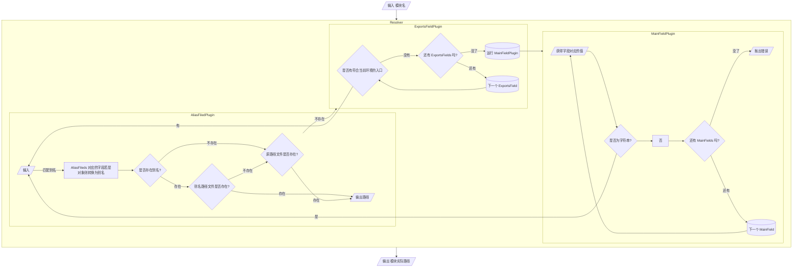
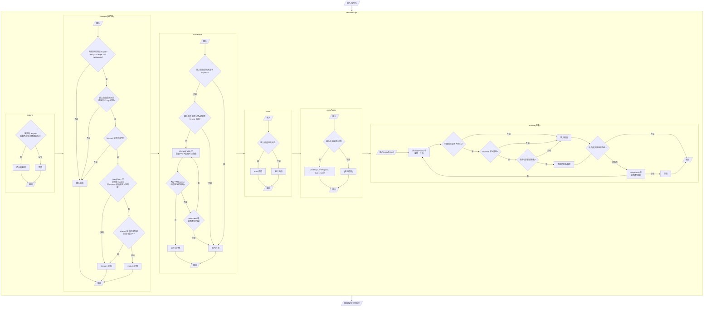

模块入口文件在 `package.json` 中进行描述，通常使用 `main`, `browser`, `module`, `exports` 等字段。本文将对各字段的意义与诞生原因、优先级进行说明。并以 **Node**、**Webpack**、**Vite** 为例，对比模块入口处理上的差异。

<!-- more -->

## 字段说明
### main
`main` 是最为基础且古老的入口字段，由 **Node** 与 **npm** 定义。当 `main` 字段都不存在时，通常会使用 `index.js` 作为入口。

>[main | package.json | npm Docs](https://docs.npmjs.com/cli/v9/configuring-npm/package-json/#main)
>
> [main | Modules: Packages | Node.js Documentation](https://nodejs.org/api/packages.html#main)

#### 使用方法
```json
{
  "main": "./index.js"
}
```

### module
`module` 字段提供符合 **ESM** 规范的模块入口。

2015年 **ESM** 规范诞生，使用 **CommonJS** 的模块规范 **Node** 开始向 **ESM** 规范过渡，社区出现了 `module` 字段的提案：[A Proposal for Node.js Modules](https://github.com/dherman/defense-of-dot-js/blob/master/proposal.md)。

但 Node 却并未采纳，而是使用了 `{ "type": "module" }` 代替。

不过，打包工具普遍支持了该字段。只是实现的与提案有很大差距，实际情况是，`module` 和 `main` 一样对待，只是优先级更高。

#### 使用方法
```json
{
  "module": "./index.esm.js"
}
```

### browser
`browser` 字段提供对浏览器环境更友好的模块入口。

来自于提案：[package-browser-field-spec](https://github.com/defunctzombie/package-browser-field-spec)。社区普遍认可、并实现该方案，然后在2018年才被 **npm** 吸收到文档（**npm** 除了文档中提到一句话以外，似乎并没有做任何工作）。

> [browser | package.json | npm Docs](https://docs.npmjs.com/cli/v9/configuring-npm/package-json/#browser)

#### 使用方法
```json
{
  "browser": "./index.browser.js"
}
```
`browser(字符串)` 将代替 `main`, `module`。

另一种对象的写法，键名(Key)匹配被访问的路径，键值(Value)则是实际路径：
```json
{
  "main": "./index.js",
  "module": "./index.mjs",
  "browser": {
    "./index.js": "./index.browser.js",
    "./index.mjs": "./index.browser.esm.js"
  }
}
```

`browser(对象)` 不仅可以作为入口文件的别名，也可以用于包内部依赖的别名，比如：
```json
{
  "main": "./index.js",
  "browser": {
    "axios": "./axios.js",
    "./dom.js": "./dom.browser.js",
    "log": false
  }
}
```
当 `./index.js` 文件使用到这三个依赖时：
- `axios` 模块解析到本地文件 `./axios.js`。
- `./dom.js` 本地文件解析到另一个本地文件 `./dom.browser.js`。
- 禁用 `log` 模块。

### exports
2018年，Node 社区出现了一个更为现代的提案：[proposal-pkg-exports](https://github.com/jkrems/proposal-pkg-exports/)，在 `Node v12.7.0` 版本实现。

`exports` 字段允许通过访问路径、运行环境(node/browser 等)、模块类型(require/import/types/css 等)组合确定最终的入口文件。

> 运行环境与模块类型的支持，Node 及打包工具之间的实现均有差异。

> `exports` 是对外提供多个入口，还有另一个字段 `imports` 是对内修改依赖（有点像 `browser`）。

#### 使用方法
说来话长，建议直接看 [Module Packages | Node.js Documentation](https://nodejs.org/api/packages.html#packages_package_entry_points) 或 [Package exports | Webpack](https://webpack.docschina.org/guides/package-exports/)。


## 优先级 默认版
虽然前端打包工具基本是运行在 **Node** 中的，但打包文件时模块的处理基本是由打包工具自己封装的 `Resolver` 处理的，存在一些差异，以下以 **Node**, **Webpack**, **Vite** 三者为例说明模块入口优先级的处理。

打包工具提供了些模块入口的配置，实际逻辑相对繁琐，不过大多数情况下我们使用的都是默认配置，所以先讲默认配置下的优先级，下一节再讲原始逻辑。

### Node 环境
1. `exports`
2. `main`

**Node** 不支持其他字段，所以非常简单。打包工具则是基于 **Node** 的标准进行扩展的。

### Webpack
1. `browser(对象)`
2. `exports`
4. `browser(字符串)`
3. `module`
5. `main`

若构建目标不是 Web，则跳过 `browser` 字段。

**Webpack** 会尽可能尝试去获得一个可以用的文件。

### Vite
1. `browser(对象)`
2. `exports`
3. `browser(字符串)`，当 `browser` 获得的文件不是 **ESM** 模块时，`module` 优先级会提升到 `browser` 之前。
4. `module`
5. `main`

若构建目标不是 Web，则跳过 `browser` 字段。

**Vite** 会按优先级获得路径后，再尝试获得文件，若获得不到则抛出错误。

## 优先级 原始逻辑版
### Webpack
**Webpack** 相关的配置主要在 `resolve` 中，主要影响优先级的有 `exportsFields`, `mainFields`, `aliasFields`，这些参数将会传给 [enhanced-resolve](https://github.com/webpack/enhanced-resolve) 处理。

- **exportsFields**：定义多个和 `exports` 相同作用的字段。
- **mainFields**：定义多个和 `main`, `browser(字符串)`, `module` 相同作用的字段。
- **aliasFields**：定义多个别名对象的字段，如 `browser(对象)`。

若用户没有设置，**Webpack** 会为他们设置默认值：
- **exportsFields**：`['exports']`。
- **mainFields**：当 `target` 为 `webworker`, `web` 或没有设置时默认值为 `['browser', 'module', 'main']`，否则为 `['module', 'main']`。
- **aliasFields**：`['browser']`。

**enhanced-resolve** 中主要由 `ExportsFieldPlugin`, `MainFieldPlugin`, `AliasFiledPlugin` 接受参数进行处理。

大致的流程图如下：


### Vite
**Vite** 的配置也主要在 `resolve` 中，有 `mainFields`, `browserField`。参数会传给 [resolvePlugin](https://github.com/vitejs/vite/blob/main/packages/vite/src/node/plugins/resolve.ts) 处理。

- **mainFields**：定义多个和 `main`, `module` 相同作用的字段。
- **browserField**，已废弃。

若用户没有设置，**Vite** 会设置默认值为：
- **mainFields**：`['module', 'jsnext:main', 'jsnext']`。
- **browserField**：`true`。

> `jsnext:main` 与 `jsnext` 和 `module` 是一样的作用，当时认为 `module` 会被标准化，所以 `jsnext` 被废弃了。[pkg.module | rollup](https://github.com/rollup/rollup/wiki/pkg.module)。

相关逻辑基本在 [resolvePackageEntrys](https://github.com/vitejs/vite/blob/HEAD/packages/vite/src/node/plugins/resolve.ts#L931) 中，以下流程图将这段代码分成了6块，并删掉了一些边缘逻辑。

最终输出的路径获取不到文件时，会抛出错误。

**Vite** 对于 `browser` 字段是单独处理的。

**Vite** 认为 `.mjs` 文件不是最优的选择，降低了他的优先级 [fix: lower .mjs resolve priority](https://github.com/vitejs/vite/commit/b15e90e6893582d04f9506ef56cc9d03c9c6d775)，但我并不明白原因。

虽然 `browserField` 废弃了，但若传值为 `false`，则基本等同于构建目标不为 Web，跳过部分逻辑。


## 其他参考
- [main-fields | esbuild - API](https://esbuild.github.io/api/#main-fields)
- [What is the "module" package.json field for?](https://stackoverflow.com/questions/42708484/what-is-the-module-package-json-field-for)
- [Node.JS (New) Package.json Exports Field](https://medium.com/swlh/npm-new-package-json-exports-field-1a7d1f489ccf)