**WebView First**，是指优先使用 WebView 进行开发，在 WebView 无法满足需求时，再使用原生（微信小程序原生，*后续提到原生皆为此意*）实现。

<!-- more -->

## 前言
首先声明立场，我是一个微信小程序黑。作为一个 Web 开发者，内心是抵制小程序的，但奈何生活所迫，该写还是得写。好在还有一条**开发的是 Web，但入口是小程序**的道路可以走。

尽管在小程序中 WebView 的应用非常普遍，但还是以原生为主的方式进行开发。缺乏以 WebView 为主的案例。

本文是我的 **WebView First** 实践的记录，希望能给想尝试 **WebView First** 的各位，提供帮助和底气。

## 介绍
### 主要原则
以 WebView 为主构建小程序，优先通过 `JS-SDK` 调用微信能力（同公众号），其次再考虑跳转到原生页面调小程序的接口。

尽可能让用户长时间停留在 WebView ，避免 WebView 与原生页面之间切换。

原生页面与 WebView 之间通过 URL 进行通信。

### 好处
1. **提升开发体验、提高开发效率**
2. 降低小程序审核频率
3. 大部分场景下有更好的性能
4. 更多的 npm 包可以使用
5. 更多的解决方案可以参考
6. 更容易地迁移到其他端

### 那代价是什么？
1. WebView 页面首次渲染较慢（首次渲染指重启小程序，并非第一次访问小程序）【可用 Web 白屏/首屏问题的优化方式进行优化】
2. 原生页面与 WebView 页面之间，切换成本高【和产品商量，减少这种场景出现】
3. 页面栈管理受限
4. 使用小程序的能力受限【小部分可用 `JS-SDK` 代替，其余需要跳转到原生页面实现】
5. `Android` 下持久储存（如 `localStorage`、`cookie`）不符合预期【详细说明见下文】
6. 无法使用现成且丰富的小程序组件【但你有更多组件库可以选择】
7. 部分组件实现的性能不如小程序提供的原生组件
8. 无法使用自定义导航栏【可以跳转到原生页面实现，但不推荐使用的原因同第2点】
9. 页面切换动画效果不一致（WebView 内切换、WebView 与原生之间切换）
10. 原生视频/直播的小窗口（画中画）在安卓中不能带到 WebView【没有很好的解决方案，避免使用画中画时前往 WebView 吧】

### 与原生 First 的差异
> 原生 First 即优先使用原生，部分页面嵌入 WebView。

- **WebView First** 大部分操作在 WebView 中进行，大幅度降低了 WebView 页面与原生页面的切换（切换和通信成本较高）
- **WebView First** 结构更为简单，基本不需要考虑小程序
- 持久储存，**原生 First** 主要存在小程序，**WebView First** 存在 WebView。

## 实践
> 本文将以 `Vue` 全家桶作为 Web 侧的技术栈进行说明。

### 小程序页面结构


为了让左上角的出现**返回**，我们需要一个入口页面（没有内容的），当入口页面 `onShow` 时，则 `navigateTo` 到 WebView 页面。

对于其他原生页，建议是想象成弹窗处理，最后都要退回到 WebView 页面。（务必和产品说好，避免出现 WebView 与原生之间的频繁跳转）

### 环境区分
从微信 `7.0.0` 开始，可以通过判断 `userAgent` 中包含 `miniProgram` 字样来判断小程序 WebView 环境。

```js
const IS_WEAPP = navigator.userAgent.toLowerCase().includes('miniprogram')
```

### 原生与 WebView 的通信
虽然小程序提供了 `message` 事件，允许 WebView 向小程序发送消息，但是由于触发条件相当苛刻，很难满足需求。

再由于需要通信的场景都是 WebView 与原生之间切换，所以采用了通过跳转地址进行传参。

具体实现见下一节。

另外，需要注意地址的长度限制。

### 路由跳转管理
路由跳转大致分为三类：
1. WebView 到 WebView
2. 原生到原生
3. WebView 到原生
4. 原生到 WebView

对应处理方式：
1. 不需要任何处理
2. 不需要任何处理
3. 使用 `JS-SDK` 进行跳转，使用 `navigateTo` 将原生页推入页面栈中
4. 尽可能使用后退的形式退回，根据情况，刷新 WebView 的内容。

3、4两种情况尽可能避免，因为 WebView 初始化略慢，这会大大降低用户体验、增加维护的难度。

然后我这边引入了第三方库 `qs` 用来对 query 进行解析和字符串化。

#### WebView 跳转到原生
我选择了路由配置和`导航守卫`进行路由管理。

```js
const router = createRouter({
  routes: [
    {
      path: '/payment',
      name: 'Payment'
      component: { /* ... */ }, // 若没有对应的页面，可设置为 404 页
      meta: {
        weapp: '/pages/payment', // 小程序中对应页面的路径
      },
    },

    /* ...其他路由 */
  ],

  /* ...其他配置项 */
})


router.beforeEach((to) => {
  /* 判断小程序环境 */
  if (!IS_WEAPP) return true

  /* 判断 meta.weapp 是否存在 */
  if (!to.meta?.weapp) return true

  // qs.stringify 将对象拼接成 key=value 形式的字符串
  const query = qs.stringify({
    // 必要的数据统一添加到 query 中，如 token
    token: 'token',
    ...to.query
  })
  const url = `${to.meta.weapp}?${query}`

  /* 调用 JS-SDK 跳转 */
  wx.miniProgram.navigateTo({ url })

  return false
})
```

#### 原生跳转到 WebView
在小程序中设置一个全局变量作为 `web-view` 的地址，当原生的 WebView 页面 `onShow` 时，更新 `web-view` 组件的 `src` 的值。

```js
// webview-src.js

/* 这个就是全局变量，也可以放到 getApp().globalData 中 */
export const state = {
  src: '',
  query: {}
}

export function setSrc(options = {}) {
  state.query = {
    is_weapp: 'true',
    ...options.query,
  }
  const _query = qs.stringify(query)

  // __WEBVIEW_URL__ 是 WebView 的访问地址
  state.src = `${__WEBVIEW_URL__}${options.path}?${_query}`
}

export function navigateBack(options, navigateOptions = {}) {
  setSrc(options)
  wx.navigateBack(navigateOptions)
}

export function navigateTo(options, navigateOptions = {}) {
  setSrc(options)
  wx.navigateTo({
    ...navigateOptions,
    url: '/pages/webview/index' // WebView 页面路径
  })
}

export function navigateTo(options, navigateOptions = {}) {
  setSrc(options)
  wx.navigateTo({
    ...navigateOptions,
    url: '/pages/webview/index' // WebView 页面路径
  })
}
```

```js
// WebView 页面的 js 文件
import * as webview  from './webview-src'

Page({
  data: {
    src: ''
  },

  onShow() {
    this.setData({
      src: webview.state.src
    })
  }
})
```

### 持久储存
正常来讲，直接使用 `localStorage` 或是 `cookie` 作为持久储存就行了。但是安卓中小程序是多进程，不同进程的 WebView 的持久储存数据是隔离的。当你把小程序的进程关了，再打开时可能会拿到和上一次完全不一样的数据。

那么，我们就需要将 WebView 的持久储存数据存到 WebView 之外。可选的只有存到小程序的 `storage` 和存到服务器。

存小程序的 `storage` 中，则必须经过 `message` 事件。存在两个问题：一、`message` 事件无法稳定触发；二、取回数据只能通过地址传数据，长度存在限制。故，这个方案被放弃了。

存到服务器，首先需要解决的是区分设备，其次再解决安全性的问题。

#### 区分设备
我采用的是由服务器生成设备 ID，存在小程序中，通过地址将设备 ID 传给 WebView。

#### 安全性
若设备 ID 泄露了，会被轻松获取到全部的持久储存数据。我们可以提高盗用的门槛，增加了一次性签名，以设备 ID 和时间作为签名数据，通过公私钥的形式创建签名。而签名的创建在小程序内进行（WebView 中也行，但会降低安全性），签名也通过地址传给 WebView。

另外还可以定期更换设备 ID。

上传数据也可以适当增加门槛，比如拉取时同样的签名机制，比如拉取时给与上传数据用的 token（下次拉取时失效），等等。

#### 其他说明
由于持久储存数据丢失，仅仅只是在小程序进程被杀的情况。所以只需要在小程序首次启动进入 WebView 的时候需要从服务器拉数据。在路由参数中增加首次访问的标识。

#### Web 侧拉取数据的处理
我用了比较粗暴的方案，在创建 Vue 实例前请求数据，将数据更新到持久储存之后直接刷新页面，同时移除地址参数中的设备 ID 和签名。

如果你的项目中，读取持久储存数据都发生在 Vue 实例创建之后，那么不必通过刷新重新读取数据。

```js
async function pullStorage() {
  /* 仅小程序环境且是安卓系统 需要拉取数据 */
  if (!(IS_WEAPP && IS_ANDROID)) return

  const url = new URL(location.href)
  const deviceId = url.searchParams.get('device_id') // 设备 ID
  const deviceSign = url.searchParams.get('device_sign') // 拉取数据用的签名
  if (!(deviceId && deviceSign)) return

  try {
    /* 发起请求 */
    const fetchUrl = `/pull-storage?id=${deviceId}&sign=${deviceSign}`
    const data = await fetch(fetchUrl).then((res) => res.json())

    /* storageKeys 是项目中所用到的 storage 的键名 */
    /* storage 是 localStorage 的封装 */
    /* 将拉取到的数据存到 localStorage 中 */
    storageKeys.forEach(key => {
      const value = data?.[key]
      storage.setItem(key, value)
    })
    
    /* 保存设备 ID，用于上传数据 */
    storage.setItem('deviceId', deviceId)
  } catch (err) {
    console.error(err) // 请求失败不做处理
  } finally {
    url.searchParams.delete('device_id')
    url.searchParams.delete('device_sign')
    location.replace(url.toString()) // 刷新页面
    await new Promise(() => {}) // 阻止渲染，等待页面刷新
  }
}

function init() {
  const app = createApp(App)
  /* ... */
  app.mount('#app')
}

pullStorage().finally(init)
```

### JS-SDK
能用 `JS-SDK` 解决的，就不要跳到原生页面。

不过要注意并不是所有 `JS-SDK` 的接口都能在小程序中使用，具体请查询 [《web-view | 微信开放文档》](https://developers.weixin.qq.com/miniprogram/dev/component/web-view.html#%E7%9B%B8%E5%85%B3%E6%8E%A5%E5%8F%A3-2)。

除了小程序特有的路由相关的接口，其他接口均需要先进行**权限验证配置**。此处有两个坑。

#### 相关配置
`JS-SDK` 所有的参数和配置，均为公众号，而非小程序。`appId` 使用公众号的；安全域名配置在公众号下。

#### wx.config 签名参数 url
不同设备、不同版本微信 url 的取值不一致。

1. `iOS` 首次访问时的地址
2. `Android` + 旧版本微信（推测 8.x 之前，没有明确的版本分界线），当前地址
3. `Android` + 新版本微信，两者皆可

另外注意不要带 `hash`。

## 总结
牺牲了特定场景的用户体验和产品设计自由度，换来开发体验、开发效率以及大部分场景的用户体验。

但是，如果对小程序原生组件或能力依赖比较严重（且不能单独分离出来一个页面），或是有不能接受的代价，不建议尝试该方案。

最后，愿世间没有小程序。
