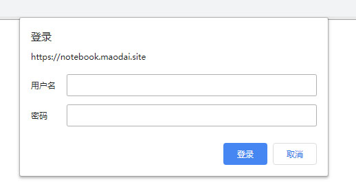

有时候服务器上会放一些不希望公开的静态资源，那么我们可以通过 Nginx 和 htpasswd 设置访问密码。

<!-- more -->

### 修改 Nginx 配置文件

``` conf
server {
    ...
    auth_basic "Please input passwod"; # 文字提示 chrome中不会显示
    auth_basic_user_file /usr/local/nginx/conf/passwd; # 认证文件
}
```

### 安装 htpasswd

``` shell
apt-get install apache2-utils
```

htpasswd 是 apache2-utils 或 mini-httpd 附带的程序。所以我们安装这两者其中一个就可以获得 htpasswd 了。

### 创建认证文件

``` shell
htpasswd -c /usr/local/src/nginx/passwd username
```
username 是设置的用户名
根据提示输入两次密码。

### 重启 Nginx
``` shell
nginx -s reload
```

现在访问网站就需要用户名和密码了。

